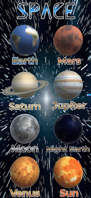
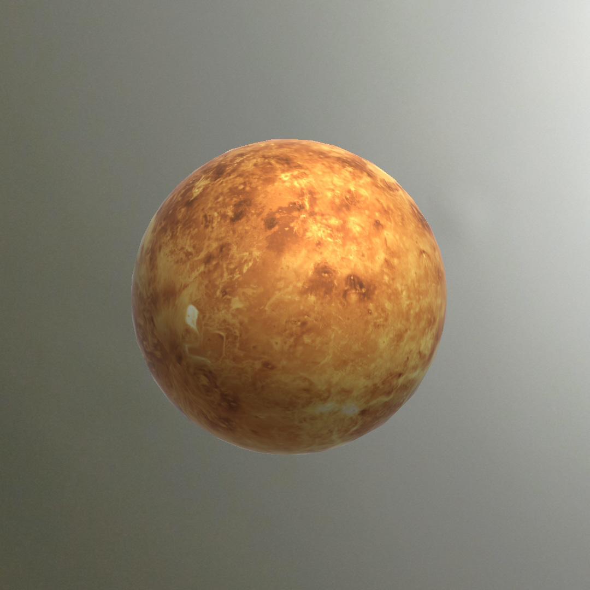

# Space - Augmented Reality

  
   

 

This is my first Augmented Reality (AR) project made with Unity 3D.

## Home Screen
The Home Screen contains several buttons. These represent planets, satellites, and stars.

  
   

## Movement
The objects hover and spin. You can zoom, move, and rotate it. 

### Zoom, Move, Rotate
You can pinch the screen to zoom in and out and change the object's size.
Use 2 fingers to move the object. Use 1 finger to rotate it manually in the X and Y direction.
After spinning towards the directed way, it stops and restarts spinning passively. 

  
   

### Hovering
The object hovers at a fixed spot even if you move away or towards it.

  
   

## Objects
These are the objects (Planets, stars, and satellites).

### Moon

  
   

### Mars

  
   

### Earth

  
   

### Sun

  
   

### Venus

  
   

## Credits
I have used free to use textures, music, and video. Sources:
1. <a href="https://www.solarsystemscope.com/textures/">Solar System Scope</a>  
2. <a href="https://uppbeat.io/">Up Beat</a>  
3. <a href="https://www.videezy.com/">Videezy</a>  
4. <a href="https://www.fontspace.com//">FontSpace</a>  